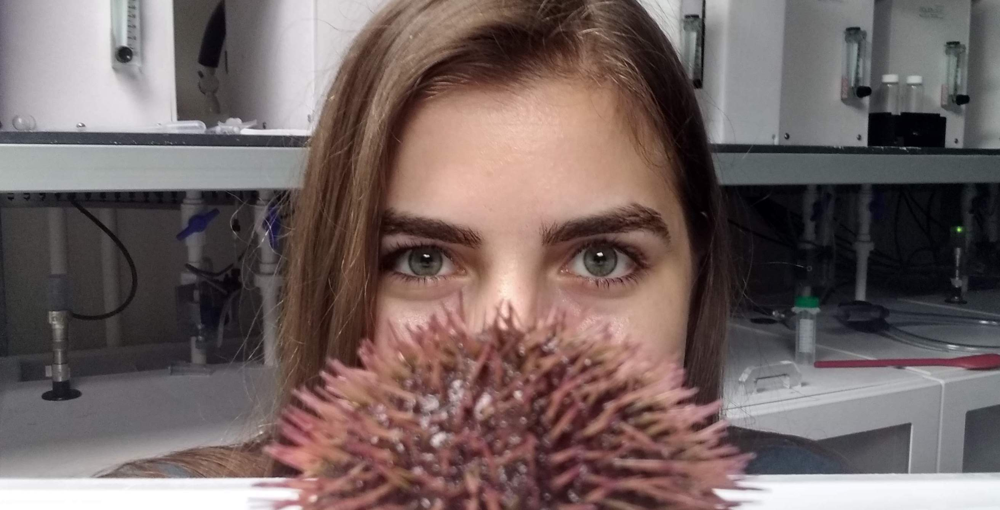
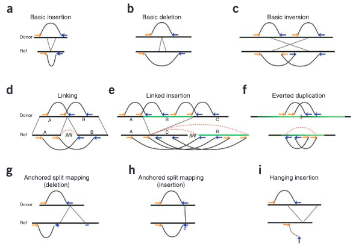
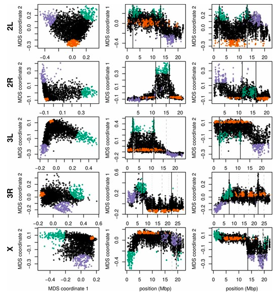
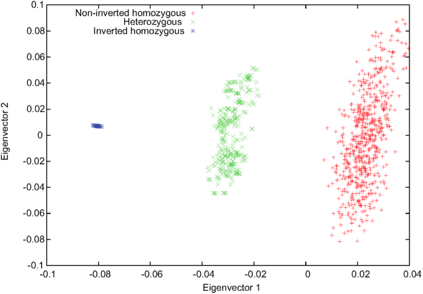
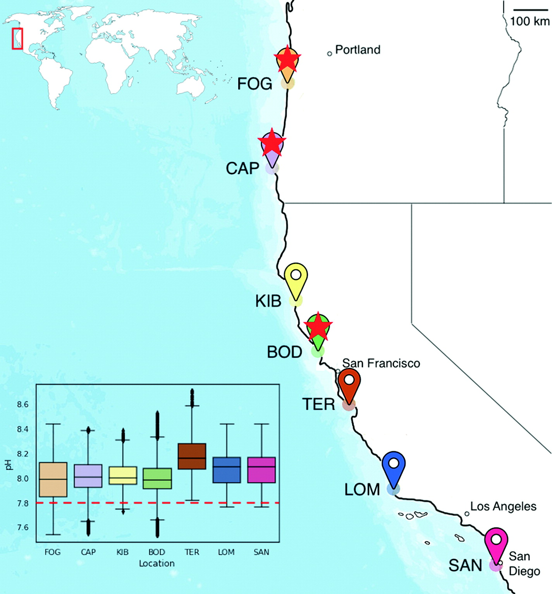
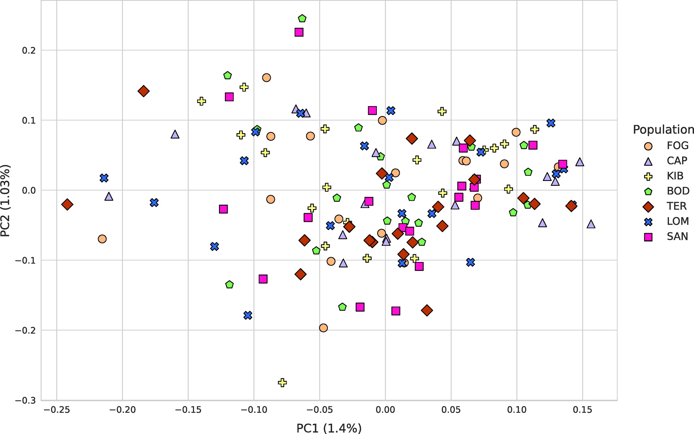

```{r, echo=FALSE, out.width = "600px", fig.align="center"}

```

# Background

## What is structural variation?

The types of genomic structural variations (SVs) are: 

- deletions 

- insertions

- duplications

- inversions

- translocations

, of at least 50 bp in size. Small variants, variants that are less than 50bp in length (single nucleotide variants (SNVs) and short insertions, and deletions (indels)), are often considered separately because then are the result of other mechanisms. Invertions and translocations are called balanced forms, while deletions, insertions, and duplications are imbalanced forms that are commonly also referred to as copy number variations.

Structural variants can result from a range of mutational mechanisms, like DNA recombination-, replication- and repair-associated processes. Here is a figure summarising these processes^[Currall, B. B., Chiangmai, C., Talkowski, M. E., & Morton, C. C. (2013). Mechanisms for structural variation in the human genome. Current genetic medicine reports, 1, 81-90.]: https://www.ncbi.nlm.nih.gov/core/lw/2.0/html/tileshop_pmc/tileshop_pmc_inline.html?title=Click%20on%20image%20to%20zoom&p=PMC3&id=3665418_nihms456963f1.jpg

## Why are structural variants interesting?

More and more studies are being published showing that SVs are an important source of genetic diversity in humans and primates (species we have the most sequence data for), contributing to their evolution. Surprisingly, it was reported that genomic differences caused by SVs are 2 to 10 times higher than differences cause by single nucleotide variants (SNVs) between human individuals. It has also been hypothesized that SVs could have a higher impact on phenotypic changes than SNVs. Given these new discoveries it is unsurprising that a lot of human diseases, including neurodevelopmental disorders and cancers, have recently been associated with SVs.^[Soto, D. C., Uribe‐Salazar, J. M., Shew, C. J., Sekar, A., McGinty, S. P., & Dennis, M. Y. (2023). Genomic structural variation: A complex but important driver of human evolution. American Journal of Biological Anthropology.]

## Methods for detecting SVs

There are two main methods for detecting SVs:^[Kosugi, S., Momozawa, Y., Liu, X., Terao, C., Kubo, M., & Kamatani, Y. (2019). Comprehensive evaluation of structural variation detection algorithms for whole genome sequencing. Genome biology, 20, 1-18.]

1. Array-based detection - such as microarray comparative genome hybridization (array CGH)
  - Pros: 
    - high-throughput analysis
    - time and money efficient
  - Cons: 
    - they only detect certain types of SVs
    - lower sensitivity for small SVs
    - lower resolution for determining breakpoints (BPs)

2. Sequencing-based computational methods
  - Pros:
    - can detect a range of SV types
    - higher resolution
  - Cons:
    - more expensive
    - high rate of miscalling of SVs (errors in base call, alignment, or de novo assembly)
    - especially in repetitive regions (though this can be overcome by long read sequencing)

Main computational approaches:

  a) Read pairs (PEM)
  
  b) Read depth 
  
  c) Split read
  
Studies investigating structural variation usually use a combination of the above mentioned approaches.

a) Uses paired-end sequencing. After the reads are mapped to the reference genome, "pairs mapping at a distance that is substantially different from the expected length, or with anomalous orientation, suggest structural variants."^[Medvedev, P., Stanciu, M., & Brudno, M. (2009). Computational methods for discovering structural variation with next-generation sequencing. Nature methods, 6(Suppl 11), S13-S20.] See image below.

```{r, echo=FALSE, out.width = "600px", fig.align="center"}

```

b) More reads mapped -> duplication, less reads mapped -> deletion.

c) Only half of the read maps.

### Local PCA

Today, we will be using a fourth method to find large inversions and to explore the structure of genetic variation in sea urchin populations in general. We are going to be using a package developed for this purpose; called local PCA. Essentially, what it does is that it creates a PCA for each genomic window (width specified by the user) in our dataset, then it creates a super PCA (well, multidimensional scaling (MDS) which is kind of the same thing) of those PCAs. Finally, it identifies a subset of windows that cluster together in the super PCA. Here is the paper describing the method: <https://academic.oup.com/genetics/article/211/1/289/5931130?login=true>. Using these results, we will identify some putative inversions and look at GO enrichment of genes that fall into those subsets of windows identified by local PCA.

Here is a visual representation of the workflow from the paper:

```{r, echo=FALSE, out.width = "600px", fig.align="center"}
knitr::include_graphics("local_pca_fig.png")
```

Example results with known inversions:

```{r, echo=FALSE, out.width = "600px", fig.align="center"}

```

In a nutshell, this pattern comes to be because the rate of recombination in the inverted region is reduced. Therefore, SNPs that were together prior to inversion stay together, even as the genetic variation changes due to recombination outside of the inverted region.

Imagine a mother that gets an original inversion in a germline cell through some mutational mechanism. When that copy pairs up during recombination, the inverted region won't recombine. Thus, whatever combination of SNPs happened to be in that region gets "preserved". In the end, if this inversion spreads in the population, every individual will one of the 3 possible genotypes:

1. Be a homozygote to the inversion and thus to that specific combination of SNPs.

2. Be homozygote without an inversion and thus have a diverse set of SNPs in that region.

3. Be a heterozygote and have a copy which is inverted and a copy that is not inverted.

Thus, if we were to make a PCA with the SNPs that are in that inverted region, we would get a figure such as this:^[Ma, J., & Amos, C. I. (2012). Investigation of inversion polymorphisms in the human genome using principal components analysis. PloS one, 7(7), e40224.]

```{r, echo=FALSE, out.width = "600px", fig.align="center"}

```

Where the number of points in each group will depend on how many individuals there are in the population for each of the above categories.

On the other hand, if we make a PCA with SNPs outside of this region, the pattern will likely be different, as individuals will cluster differently on the PCA. That is why you can see windows that plot similarly on a PCA within the inverted region on the figure above (the second figure in this section).

# The dataset

The paper describing the urchin dataset that we will be analyzing is available here: https://www.journals.uchicago.edu/doi/10.1086/726013

We collected, shipped, extracted DNA, and sequenced the whole genomes of 140 purple sea urchins (Strongylocentrotus purpuratus), 20 from each of seven sites (figure below). Coordinates for collection sites were chosen on the basis of pH data collected by autonomous pH sensors mounted submerged in the water at ecologically relevant depth for this sea urchin species. Paired-end sequencing using NovaSeq S2 Flow Cell 150 × 150 bp on a single lane resulted in high-quality reads, such that no trimming was necessary.

```{r, echo=FALSE, out.width = "600px", fig.align="center"}

```

Relevant results:

  - High genetic diversity
  
  - No overall population structure due to high gene flow
  
```{r, echo=FALSE, out.width = "600px", fig.align="center"}

```

# Steps already completed

The following steps are already completed for you, you will not need to run any of this (mapping and variant calling).

## Mapped reads to the reference

### The reference genome

<https://www.ncbi.nlm.nih.gov/datasets/genome/GCF_000002235.5/>

N50: 37.3 Mb

"Length of the shortest contig for which longer and equal length contigs cover at least 50 % of the assembly".

21_scaffolds file in the `/netfiles/ecogen/structural_variation/`

### The mapping algorythm

Input: List of read files (R1 and R2)

```{bash, eval = FALSE}
while read line ; do
        F1=$(cut -d ' ' -f1 <<< $line)
        F2=$(cut -d ' ' -f2 <<< $line)
        echo "$F1 -- $F2"
        FILE=$(mktemp)
        cat header.txt >> $FILE
        echo "spack load samtools@1.10" >> $FILE
        echo "spack load bwa@0.7.17" >> $FILE
        ref="/users/c/p/cpetak/WGS/reference_genome/GCF_000002235.5_Spur_5.0_genomic.fna"
        out_name=$(cut -d '.' -f1 <<< $F1)
        echo "bwa mem -t 1 -M $ref /users/c/p/cpetak/WGS/all_fastqs/$F1 /users/c/p/cpetak/WGS/all_fastqs/$F2 | samtools view -S -b > /users/c/p/cpetak/WGS/BWA_out/$out_name.bam" >> $FILE
        sbatch $FILE
        sleep 0.5
        rm $FILE
done < $1
```

The Burrows-Wheeler Alignment Tool (BWA) MEM algorithm was used for mapping the raw reads to the S. purpuratus reference genome (Spur ver. 5.0, scaffold N50 ∼37 Mbp). The average coverage for each individual was 6.42±0.78, with an average mapping rate of 81.6±0.01.

## Called variants for each chromosome across all individuals

Input:

-   21_scaffolds

-   list_of_files.txt, 140 lines, line 1: `/users/c/p/cpetak/WGS/BWA_out/BOD_18170X61_200925_A00421_0244_AHKML5DSXY_S81_L002_R1_001.rmdup.bam`

```{bash, eval = FALSE}
while read line ; do
	echo "$line"
	FILE=$(mktemp)
  cat header.txt >> $FILE
  ref="/users/c/p/cpetak/WGS/reference_genome/GCF_000002235.5_Spur_5.0_genomic.fna"
  echo "echo "${line}" " >> $FILE
  echo "bcftools mpileup -r $line -f $ref --bam-list list_of_files.txt | bcftools call -mv -Ob -o multi_bam_${line}.bcf" >> $FILE
  sbatch $FILE
  sleep 0.5
  rm $FILE
done < $1
```

Output: bcf files in the `/netfiles/ecogen/structural_variation/bcf_files directory`

# Filtering the bcf files

Before we do anything else, let's filter these bcf files. In order to look at them we will convert them into a vcf format shortly.

## List of chromosomes to choose from:

```{bash, eval = FALSE}
1. NW_022145594.1
2. NW_022145595.1
3. NW_022145596.1
4. NW_022145597.1
5. NW_022145598.1
6. NW_022145601.1
7. NW_022145602.1
8. NW_022145603.1 # Csenge
9. NW_022145604.1
10. NW_022145605.1
11. NW_022145606.1
12. NW_022145610.1
13. NW_022145611.1
14. NW_022145612.1
15. NW_022145613.1
16. NW_022145614.1
17. NW_022145615.1
```

## Copy files you will be working with

-   Make a new directory in `~/mydata` called str_data (use the mkdir command)

-   Do the following in tmux as it could take some time for the copying to finish.

-   Copy your bcf file into that new directory. You can do this by typing the following, and replacing the chromosome number with YOURS: `cp /netfiles/ecogen/structural_variation/bcf_files/multi_bam_mychromosome.bcf ~/mydata/str_data`

-   Check that you have the data you'll need in `~/mydata/str_data`, a multi_bam_mychromosome.bcf file.

## Write a bash script to do the filtering for your chromosome

-   cd into your myscripts directory, `cd ~/myscripts`

-   type `vim filter_chromosome.sh`, then hit the "i" key to enter insert mode

-   copy the following lines:

```{bash, eval = FALSE}
#!/bin/sh

mychr="NW_022145603.1" # Replace this with your chromosome

# use bcftools to filter your chromosome. The output of this line will be a vcf file that we can look at
# NOTE: Everyone will be writing to the same shared directory, so please make sure that you have the correct chromosome name above

bcftools view -e 'QUAL <= 40 || DP < 560 || MQB < -3 || RPB < -3 || RPB > 3 || AN < 238' ~/mydata/str_data/multi_bam_${mychr}.bcf > ~/mydata/str_data/${mychr}_filtered.vcf

echo "Filtered bcf" # Some printing to keep track of progress

# Convert the filtered vcf into the bcf file type which is the type the R package will be expecting

bcftools view -Ob ~/mydata/str_data/${mychr}_filtered.vcf > ~/mydata/str_data/${mychr}_filtered.bcf

echo "Converted to bcf" # Some printing to keep track of progress

# Index the filtered bcf file. This will make the file more searchable by the algorythm reading it.

bcftools index ~/mydata/str_data/${mychr}_filtered.bcf
echo "Indexed bcf"
echo "Done!"
```

-   Hit `esc`, then type `:wq`

## A bit on tmux

Before running the script above in tmux, I wanted to go over how to use tmux in a few minutes.

Tmux is a great package that allows you to switch easily between several programs in one terminal, detach them (they keep running in the background) and reattach them when you want to look at it again.

When you type `tmux` and hit enter, you create a new session that you can detach from using `Ctrl B + D`. However, if you type tmux again in the future, you will again create a new session instead of opening the previous one. If you do this repeatedly, you will end up creating a lot of sessions in the background at the same time. In order to be able to navigate back to a specific session later, you should instead type:

`tmux new -s mysession` where mysession is the name of your session. So, for example now you can type:

`tmux new -s bcf_filtering`. Then you can list the sessions you are currently running with

`tmux ls`. If you see a lot of sessions being printed to the screen and you want to get rid of them all, type

`tmux kill-session`. Great! Now that your tmux is all clean, let's create a new session again named bcf_filtering:

`tmux new -s bcf_filtering`. Hit Enter. Type `Ctrl B + D`. Since we named it, you can open the same session again:

`tmux attach-session -t bcf_filtering`. Yay! Now run the filtering script by typing `bash filter_chromosome.sh`. The code should complete in 6 minutes. Hit `Ctrl B + D` to detach the session. If you want to look at the progress, you can type `tmux attach-session -t bcf_filtering` again!

## The vcf file format

While the filtering is running, let's look at the vcf file that we are creating in the process. I have an example for you ready in `/netfiles/ecogen/structural_variation/examples`. Go ahead and cd into it. DO NOT try to open the vcf file with vim, it WILL crush your computer :). Instead, type `head NW_022145602.1_filtered.vcf` to print the first 10 lines.

VCF, variant call format, is an extremely common, standardized file format to store genetic information in. It always starts with a few (or many in our case) header lines that start with `##`. These header lines contain information about how the vcf file was generated, followed by information about the reference. Go ahead and type `more NW_022145602.1_filtered.vcf` and hit Enter. The more command is similar to the head command, but it allows you to move down in the file by hitting Enter. You will see that we have a lot of scaffolds listed in this file, so instead of hitting and infinite amount of Enters, hit `Ctrl C` to exit the more command, and then type `more -900 NW_022145602.1_filtered.vcf` to jump to line 900. After all the scaffold information, you will see a description of what the different sections in the INFO column in the vcf file mean. I decided to filter on:

-   DP, which is Raw read depth, across all individuals (so 560 reads is 4 depth on average among 140 individuals)

-   MQB, Mann-Whitney U test of Mapping Quality Bias, "If p \< 0.05, it suggests there is significant bias i.e. the reads supporting alternate allele have lower mapping quality than reads supporting reference allele. The bigger p value is better."

-   RPB, Mann-Whitney U test of Read Position Bias, "alleles present at the end of reads may not be right".

-   AN, Total number of alleles in called genotypes, we have a total of 2 (heterozygote) x 140 (number of individuals) alleles. 85% is my cut off.

I decided on these values based on similar literature I found, and also the percent data loss after applying different levels of filtering.

Now let's look further down in the file. You should see a header line that lists the column names:

`#CHROM POS ID REF ALT QUAL FILTER INFO FORMAT` followed by a 140 long names. This is a standard format. Keep pressing enter until you find the first line.

-   CHROM is the chromosome name

-   POS is the position in the chromosome

-   ID can be an ID assigned to the specific variant. In some model organisms, like humans, there are known named variants. That information would go here. If you are curious, you can browse those here: <https://www.ncbi.nlm.nih.gov/variation/view/>

-   REF allele in the reference

-   ALT allele in your dataset

-   QUAL posterior genotype probability in Phred scale. QUAL = 20 means there is 99% probability that there is a variant at the site. I decided to filter out sites with QUAL \<= 40.

-   FILTER If all filters are passed, PASS is written in the filter column. These are default filters during the variant calling, takes depth of coverage, genotyping quality and variant quality into account.

-   INFO Some information about the variant, see description in the vcf file header lines I mentioned above.

-   FORMAT Specifies the format in which the genotype data is given. In this case, it is GT:PL. GT - Genotype, PL - List of Phred-scaled genotype likelihoods.

Let's look at an example!

Example 1:

```{bash, eval = FALSE}
NW_022145602.1	1564	.	T	A	129	.	DP=599;VDB=0.259328;SGB=31.2596;RPB=0.70951;MQB=0.816143;MQSB=0.0194;BQB=0.892443;MQ0F=0.358932;ICB=0.000506821;HOB=0.000246914;AC=3;AN=270;DP4=385,98,11,1;MQ=21	GT:PL	./.:0,0,0	0/0:0,12,76	0/0:0,6,74	0/0:0,15,118	0/0:0,3,4	0/1:31,0,28	0/0:0,9,40	0/0:0,6,7 0/0:0,6,42	0/0:0,12,11	0/0:0,3,4	0/0:0,3,37	0/0:0,21,171	0/0:0,3,4	./.:0,0,0	0/0:0,15,69	0/0:0,15,41	0/0:0,24,99	0/0:0,6,67	0/
0:0,12,77	0/0:0,15,120	0/0:0,15,117	0/0:0,3,37	0/0:0,9,42	0/0:0,9,13	0/0:0,21,98	0/0:0,9,9	0/0:0,3,37	0/0:0,3,40	0/0:0,15,69	0/
0:0,15,16	0/0:0,12,43	0/0:0,3,4	0/0:0,9,75	0/0:0,18,119	0/0:0,6,36	0/0:0,6,39	0/0:0,3,37	0/0:0,15,98	0/0:0,6,39	./.:0,0,0	0/
0:0,9,77	0/0:0,9,74	0/0:0,12,60	0/0:0,3,4	0/0:0,6,39	0/0:0,12,44	0/0:0,9,68	0/0:0,15,103	0/0:0,9,71	0/0:0,18,122	0/0:0,9,40	0/
0:0,12,59	0/0:0,18,102	0/0:0,6,64	0/0:0,15,71	0/0:0,12,99	0/0:0,6,74	0/0:0,3,37	0/0:0,24,128	0/0:0,18,108	0/1:122,0,34 (...)
```

0/0: homozygote to the alternative allele 0/1: heterozygote. since we don't know which allele is coming from which parent, 0/1 just means heterozygote, and you won't see 1/0 anywhere. 1/1: homozygote for the alternative allele

The likelihood scores: "Scores for 0/0 (homozygous ref), 0/1 (heterozygous), and 1/1 (homozygous alt) genotypes. For a phred-scaled likelihood of P, the raw likelihood of that genotype L = 10\^(-P/10) (so the higher the number, the less likely it is that your sample is that genotype). The sum of likelihoods is not necessarily 1."

NOTE: in module 1, population genetics on red spruce data, we were looking at SNP information at biallelic sites. As you can see if you scroll down, this dataset also includes sites with duplications/deletions/insertions, as well as triallelic (or even quadrallelic) sites.

Example 2:

```{bash, eval = FALSE}
NW_022145602.1	1553	.	ag	a,aGg	999	.	INDEL;IDV=7;IMF=0.7;DP=583;VDB=0.0245597;SGB=-53.7492;MQSB=0.0144647;MQ0F=
0.447684;ICB=0.473584;HOB=0.0514945;AC=79,2;AN=274;DP4=286,108,161,28;MQ=20	GT:PL	0/0:0,3,4,3,4,4	0/0:0,5,57,9,60,57	0/0:0,9,42
,9,42,42	0/1:26,0,1,44,10,35	0/0:0,3,4,3,4,4	0/0:0,12,69,12,69,69	0/1:25,5,0,28,9,25	0/1:7,5,0,10,9,7	1/1:39,6,0
,39,6,39	0/0:0,15,12,15,12,12 (...) 1/1:21,8,0,24,12,21	0/0:0,18,33,12,36,33	0/0:0,6,34
,6,34,34	0/1:6,0,69,15,72,81	0/1:3,0,25,18,31,35	0/1:55,5,0,61,12,56	0/0:0,9,87,9,87,87	0/0:0,15,60,15,60,60	0/
0:0,3,3,6,6,4	0/0:0,3,4,3,4,4	1/1:48,9,0,57,21,49	0/1:16,0,3,22,9,24	1/1:52,6,0,52,6,52	0/0:0,21,81,21,81,81	0/1:0,0,16
,6,25,21	0/0:0,9,61,9,61,61	0/1:27,0,42,36,51,74	0/1:44,0,26,59,32,77	0/1:14,0,30,23,33,50	0/1:20,3,0,20,3,20	1/
1:72,12,0,72,12,72	0/1:23,3,0,29,9,25	0/0:0,12,13,12,13,13	0/1:26,5,0,29,9,26	0/0:0,9,21,9,21,21	0/1:3,3,0,6,6,4	0/
0:0,15,65,15,65,65	0/0:0,5,58,9,61,58	0/0:0,9,15,9,15,15	0/0:0,3,4,3,4,4	0/1:48,0,16,54,28,70	0/0:0,1,22,3,25,24	0/
1:11,2,0,17,6,14	1/2:89,62,59,30,0,22	0/1:50,3,0,53,6,51	0/0:0,6,8,6,8,8	0/0:0,3,31,3,31,31	0/0:0,9,37,9,37,37	0/
0:0,15,109,15,109,109	0/1:17,0,78,35,81,108	0/0:0,2,78,12,81,85	0/1:47,0,56,59,69,110	1/1:68,6,0,68,6,68	0/0:0,9,55,9,55,55
	0/0:0,9,65,9,65,65	0/1:2,0,1,14,4,12	0/0:0,9,71,9,71,71	1/1:99,18,0,99,18,99	0/2:62,71,94,0,36,27 (...)
```

In this case, the reference is AG, the first alternative allele has a deletion of the G, and the second alternative allele has an addition of a G! So for example, 0/2 is a heterozygote where one copy has the insertion, and 1/1 is a homozygote for the deletion.

# Running local PCA

Local PCA is an R package, here is the GitHub page: <https://github.com/petrelharp/local_pca>. I already installed this package on the class server following the instructions in the README.md. You should be able to use it without doing anything.

On the page, they also provide an Rscript to use the package and a separate one to visualise the results, which I copied to the server (and slightly modified): `/netfiles/ecogen/structural_variation`.

-   Copy the R scripts over to your myscripts directory: `cp /netfiles/ecogen/structural_variation/run_lostruct.R ~/myscripts` and `cp /netfiles/ecogen/structural_variation/summarize_run.Rmd ~/myscripts`

## Let's look at the scripts

Type vim run_lostruct.R in the \~/myscripts directory.

## Run local PCA

-   IMPORTANT: make sure to remove the original unfiltered bcf file from your `~/mydata/str_data` directory, `rm multi_bam_mychromosome.bcf`, because the package will read all .bcf files in the directory that you give it and we only want to run the package on the filtered bcf file.

-   `tmux new -s run_localPCA`

-   `cd ~/mydata/str_data`. This way the results will automatically end up in this directory.

-   `Rscript ~/myscripts/run_lostruct.R -i ~/mydata/str_data -t snp -s 1000 -I /netfiles/ecogen/structural_variation/sample_info.tsv` We are running the Rscript with the "Rscript" command, just like we run the bash scripts with the "bash" command. -i specifies the input file location, -t specifies the way we are calculating the windows, which is based on SNPs for now. -s specifies the window size. -I specifies the location of the file I created to link the individual IDs in the bcf file with the 3 letter population name. This should take 15 minutes to an hour to run.

-   Once the script finishes, you should have a folder called lostruct_results in `~/mydata/str_data`. cd into lostruct_results. Then, cd into a folder called something like type_snp_size_1000_weights_none_jobid_166584 (will be called different for you). Type `ll`.

-   Output files:

    -   config.json -\> check with vim

    -   mds_coords.csv -\> wc -l -\> how many lines are there? each line corresponds to a window

    -   mychromosome.pca.csv -\> wc -l to check the number of rows and `awk -F',' '{print NF}' mychromosome.pca.csv | sort -nu | tail -n 1` to check the number of columns -\> should be 283. For each window (rows), PC1 and PC2 for each individual (140) -\> input variables for the MDS

    -   mychromosome.regions.csv -\> windows information (will be important later)

## Visualise results

NOTE: Make sure to change the `type_snp_size_1000_weights_none_jobid_166584` directory name everywhere in this tutorial to your directory name!

Now we'll use another script provided by the local PCA package to make an html with a series of plots.

-   `tmux attach-session -t run_localPCA`

-   cd into `~/mydata/str_data/lostruct_results/type_snp_size_1000_weights_none_jobid_166584/`

-   type `Rscript -e 'templater::render_template("~/myscripts/summarize_run.Rmd",output="~/mydata/str_data/lostruct_results/type_snp_size_1000_weights_none_jobid_166584/run_summary.html",change.rootdir=TRUE)'`

-   This should only take a few minutes. Once done, you should have new files in your `type_snp_size_1000_weights_none_jobid_166584` directory.

-   Open FileZilla on your computer. Move run_summary.html in the `~/mydata/str_data/lostruct_results/type_snp_size_1000_weights_none_jobid_166584` directory to your computer.

-   Find that file on your computer and open it in your favorite browser (e.g. Chrome).

## Select regions of interest

In order to be able to get the genomic regions corresponding to a specific corner in the MDS plot, we will need to modify the plotting script (summarize_run.Rmd) such that it writes a csv file with the coordinates.

-   `cd ~/myscripts`, `vim summarize_run.Rmd`, hit I to enter the insert mode.

-   Around line 195, the script creates a variable called corner.regions based on the mds corners. This variable contains a list of chromosome, start, end information for each window in each corners of the mds plot. So, all we need to do is insert a line `write.csv(corner.regions[[1]], "first_corner.csv", row.names=FALSE)` under the line 198 (`}`) to save the genomic regions in the first corner.

-   Hit `esc` and `:wq` to save your changes.

Repeat steps above to rerun the plotting.

-   `tmux attach-session -t run_localPCA`

-   cd into `~/mydata/str_data/lostruct_results/type_snp_size_1000_weights_none_jobid_166584/`

-   type `Rscript -e 'templater::render_template("~/myscripts/summarize_run.Rmd",output="~/mydata/str_data/lostruct_results/type_snp_size_1000_weights_none_jobid_166584/run_summary.html",change.rootdir=TRUE)'`

-   Now you should have a new file in `type_snp_size_1000_weights_none_jobid_166584` called `first_corner.csv`. Type `head first_corner.csv` to see the region information. NOTE: if you are not seeing the new file appear, you might have to delete the cache directory (`rm -r cache`) first, and then rerun the Rscript again.

## Do GO Enrichment for the selected corner

In order to get a list of genes that are present in the selected windows, we will use an annotation file from ncbi: <https://www.ncbi.nlm.nih.gov/datasets/genome/GCF_000002235.5/>. GFF is a standard file format to store genomic annotation information in. I have already downloaded this file and moved it to `/netfiles/ecogen/structural_variation/`, and named it genome_annotation.gff. 

Copy this file into your directory, `cp /netfiles/ecogen/structural_variation/genome_annotation.gff ~/mydata/str_data/lostruct_results/type_snp_size_1000_weights_none_jobid_166584` Let's take a look!

To find an intersect between genes specified in the GFF file and coordinates in our first_corner.csv, we will use a package called bedtools. I have already installed this package for you. The intersectBed algorithm requires the first_corner.csv to be in a specific format (tab delimited, chromosome, start, end), so we'll need to modify it.

-   `cd ~/mydata/str_data/lostruct_results/type_snp_size_1000_weights_none_jobid_166584` if you are not there alread.

-   `head first_corner.csv` -\>

```{bash, eval = FALSE}
"chrom","start","end","pos"
"NW_022145602.1",227538,246919,237228.5
"NW_022145602.1",246921,249982,248451.5
"NW_022145602.1",250053,258244,254148.5
"NW_022145602.1",268365,272067,270216
"NW_022145602.1",283027,289393,286210
```

-   Remove 4th column: `cut -d, -f1-3 first_corner.csv > first_corner_formatted.csv` -\>

```{bash, eval = FALSE}
"chrom","start","end"
"NW_022145602.1",227538,246919
"NW_022145602.1",246921,249982
"NW_022145602.1",250053,258244
"NW_022145602.1",268365,272067
```

-   Remove "s: `sed -i 's/"//g' first_corner_formatted.csv`

-   Replace commas with tabs: `sed -i 's/,/\t/g' first_corner_formatted.csv` -\>

```{bash, eval = FALSE}
chrom	start	end
NW_022145602.1	227538	246919
NW_022145602.1	246921	249982
NW_022145602.1	250053	258244
NW_022145602.1	268365	272067
```

Now that we have the correct file format, let's run the intersectBed algorythm: `/netfiles/ecogen/structural_variation/bedtools2/bin/intersectBed -a first_corner_formatted.csv -b genome_annotation.gff -wa -wb > genes_first_corner.bed` Look at the genes_first_corner.bed file.

To extract the gene names: `sed -n "s/^.*gene=\(LOC[0-9]\+\).*$/\1/p" genes_first_corner.bed > gene_names_first_corner.txt`

You'll see that a lot of the gene names are repeated. To discard repeats, type: `sort gene_names_first_corner.txt | uniq > uni_gene_names_first_corner.txt`

Go to FileZilla on your computer and download this file (mydata/str_data/lostruct_results/type_snp_size_1000_weights_none_jobid_166584/uni_gene_names_first_corner.txt).

Now we can run a gene ontology analysis on these genes!

-   Open the txt file above, select all, copy (Ctrl C).

-   Go to: <https://geneontology.org/>, paste the LOC names into the window on the right.

-   Select Strongylocentrotus purpuratus (purple sea urchin) from the drop down menu instead of Homo sapiens. Click Launch.

-   If you don't get any significantly enriched biological processes, you can change the Annotation Data Set in the drop down menu and click Launch analysis. You can also play around with the Test type and the correction method. Don't worry if you still don't get anything, that is also a valid result!

Congrats! You are all done with this tutorial! :)

References:
