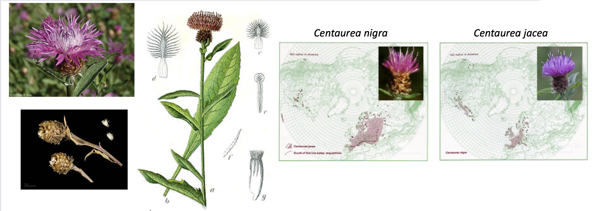

# Learning Objectives for 09/10/24

1.  To get background on the study system (invasive hybrid knapweeds, *Centaurea jacea* complex), and the experimental design of the GBS sequencing data

2.  Setup file structure in our github repo's and introduce the process of taking notes on our coding and data decisions as we document our work each day.

3.  To visualize and interpret Illumina data quality (what is a fastq file; what are Phred (Q) scores?).

4.  To understand the general work flow or "pipeline" used for processing the raw GBS data to create the variant call file (VCF)

5.  Begin working with VCF files in R and explore filtering options to QC the initial SNP calls to attain a reduced set of high-quality variants for downstream analysis.


## 1. Hybrid meadow knapweed: the *Centaurea jacea* complex

Hybridization is an important mechanism for speciation in plants. Yet as humans move species around to new habitats, admixture and hybridization can also promote invasive behavior in species.  In this dataset, we will be investigating invasive weeds that are putatively hybrids between brown knapweed (*Centaurea jacea*), black knapweed (*C. nigra*) and their recombinant progeny, known as meadown knapweed (*Centaurea moncktonii*). 


The two parental progenitor species are native to Europe and have been introduced to North America (USA and Canada). They may or may not hybridize in Europe, but previously published work by Steve, Jane Molofsky, and colleagues found evidence of widespread hybridization in northeastern USA (VT and NY) using **GBS (Genotype-By-Sequencing)** data [(Lachmuth et al. 2019)](https://academic.oup.com/aobpla/article/11/5/plz055/5554115). Look at the Lachmuth study for info on the invasion history if you're interested. 

Since that study, we have sampled additional populations in the native range of Europe (Spain, France, Germany, Luxembourg, and Norway) as well as a distinct region of the introduced range in North America (WA and OR in the Pacific Northwest). 




### A new dataset for analysis!

The data we'll be analyzing here consist of Genotype-By-Sequencing (GBS; aka, RAD) data for many individuals sampled from populations located in 3 different regions: the native range in Europe (EU), and 2 regions in the introduced range of North America (Northeast, NE; and Pacific Northwest, PNW). Here are the details:

-   629 individuals sampled from 74 populations across the EU range (N=194 inds; 31 pops) and the NA range (N=435 inds; 38 pops).

-   Individuals were extracted for total genomic DNA and used to prepare GBS libraries according to [Elshire et al. (2011)](https://journals.plos.org/plosone/article?id=10.1371/journal.pone.0019379)

-   96 individuals at a time were barcoded in multiplexed GBS libraries and sequenced on an Illumina Hi-Seq for either 150 bp single-end (SE) reads.  *Why GBS instead of other sequencing approaches?*


### What questions present themselves that we might investigate with GBS data from these 3 sampled biogeographic regions?


## 2. Notetaking and organization within your `eco_genomics` repo

We want you to setup a specific file structure within your eco_genomics github repo. For each module of the course, we'll have a folder (here: `population_genomics`). Within the newly created `population_genomics` folder, make 3 new folders:

* `docs` -- used to store your Rmarkdown files containing your scripting work
* `outputs` -- used to store your processed data, results files, and other outputs
* `figures` -- used to store figures you want to export

In addition, let's setup a general notebook to contain our coding and data notes.  

An important part of coding is taking good notes on your workflow so you can remember what you did down the road (your "future self") and share your process with others (reproducible science!). It's also really important once you start making detailed decisions that will affect the analysis outcome of your data, so you can recreate the results and explore the effect of different assumptions/decisions.

We want you to keep such a notebook for each module in the course (kind of like you would for each experiment, or each thesis chapter you will work on). 

You can create a new blank text file and save it under the general `population_genomics` folder. You can then open it up and edit this file directly within RStudio, taking notes using either the `Source` interface if you know the markdown language (or want to learn) or you can use RStudio's built-in markdown GUI editor under the `Visual` tab. This works very similar to Word.

Here's a [Markdown cheatsheet](https://docs.github.com/en/get-started/writing-on-github/getting-started-with-writing-and-formatting-on-github/basic-writing-and-formatting-syntax) if you want to write using `Source` code:


## 3. The raw sequencing data: fastq files (`.fastq` or `.fq`) *note: files often compressed* (`.fq.gz`)

[A fastq file is the standard sequence data format for NGS](https://en.wikipedia.org/wiki/FASTQ_format). It contains the sequence of the read itself, the corresponding quality scores for each base, and some meta-data about the read.

The files are big (typically many Gb compressed), so we can't open them completely. Instead, we can peek inside the file using `head`. But size these files are compressed (note the .gz ending in the filenames), and we want them to stay compressed while we peek. Bash has a solution to that called `zcat`. This lets us look at the .gz file without uncompressing it all the way. Let's peek inside a file:

```         

[srkeller@vacc-user2 example_data]$ zcat WV_9.R1.fq.gz | head -n4
@HISEQ:157:170524_SNL128_0157_AHJHFNBCXY:1:1101:1420:2055 1:N:0:CCACA
TCCCCCTGCCGCCGATGCTGATGTTCGACCGCATCACCTCGATCGGGACCGAGGGCGGCGCCTACGGCAAGGGCCATGTCCTGGCGGAATTCGACGTGCGGCCGGACCTCT
+
IIIIIIIGGIIIIIIGGIIIIIGIGIGIIIIIIIIIIIGGIIIIIIIIIIIIIIIIIIIIIIGIIGGIIIIGIIIIIIIIIIIIIIIIGGIGGIIIIIIIIIIIIGGIIGG

```

*Note:* `zcat` lets us open a .gz (gzipped) file; we then "pipe" `|` this output from `zcat` to the `head` command and print just the top 4 lines `-n4`

The fastq file format has 4 lines for each read:

| Line | Description                                                                                                   |
|--------------------------|----------------------------------------------|
| 1    | Always begins with '\@' and then information about the read                                                   |
| 2    | The actual DNA sequence                                                                                       |
| 3    | Always begins with a '+' and sometimes the same info in line 1                                                |
| 4    | A string of characters which represent the **quality** scores; always has same number of characters as line 2 |

[Here's a useful reference for understanding Quality (Phred) scores](http://www.drive5.com/usearch/manual/quality_score.html). If P is the probability that a base call is an error, then:

Q = -10\*log10(P)

So:

| Phred Quality Score | Probability of incorrect base call | Base call accuracy |
|--------------------|---------------------------------|-------------------|
| 10                  | 1 in 10                            | 90%                |
| 20                  | 1 in 100                           | 99%                |
| 30                  | 1 in 1000                          | 99.9%              |
| 40                  | 1 in 10,000                        | 99.99%             |

*The Phred Q score is translated to ASCII characters so that a two digit number can be represented by a single character.*

```         
 Quality encoding: !"#$%&'()*+,-./0123456789:;<=>?@ABCDEFGHI
                   |         |         |         |         |
    Quality score: 0........10........20........30........40   
```

*What kind of characters do you want to see in your quality score?*


## 4. Overview of bioinformatics pipeline -- 

This has been done already, but is important to understand how we arrived at the SNP dataset you will be working with...

Our initial pipeline started with the raw fastq files and followed these steps:

-   Illumina reads were demultiplexed, trimmed of adapters, and low quality sequence (Q20) removed using [`fastp`](https://github.com/OpenGene/fastp). [Here's a summary of pre- and post fastq trimming with `fastp`](pics/E11_R1_clean.fastq.gz.html).

-   Cleaned reads were then aligned to the *Centaurea solstitialis* reference genome [Reatini et al. (2024)](https://www.biorxiv.org/content/10.1101/2022.09.28.509992v2) and [Genbank Genome Assembly GCA_030169165.1](https://www.ncbi.nlm.nih.gov/datasets/genome/GCA_030169165.1/) using the Burrows Wheeler Alignment (bwa) software [Li and Durbin 2009](https://www.ncbi.nlm.nih.gov/pmc/articles/PMC2705234/pdf/btp324.pdf).  

-   While the reference genome used is in a different species with a different base chromosome count (*C. solstitialis* 1n=8) (*C.jacea* complex 1n=11), there is broadly conserved synteny (i.e., genome order and structure) across species and even genera in this section of the Sunflower family. See for example [Fig 2.](https://www.biorxiv.org/content/biorxiv/early/2024/09/04/2022.09.28.509992/F2.large.jpg?width=800&height=600&carousel=1) from Reatini et al. (2024)

-   Alignments were then converted to binary format, sorted, and indexed with samtools and then genotyped for variants with bcftools [Danecek et al. 2021](https://academic.oup.com/gigascience/article/10/2/giab008/6137722?login=false). 

**Here's a table of the *C. solstitialis* reference genome stats:**


-   The result was a Variant Call File (VCF) -- which is the standard population genomic file format for storing genotype data. More [info on VCF files here](https://en.wikipedia.org/wiki/Variant_Call_Format).

-   Our VCF file was then initially filtered using [vcftools](https://vcftools.github.io/man_0112a.html#OUTPUT%20OPTIONS) using the following criteria:
  * SNP sites with minor allele count <5 (`--mac`)
  * SNP sites with >50% missing data across individuals (`--max-missing 0.5`)
  * individuals missing >75% data across SNP sites (`--remove-indv`)
  
-   We can peek into the resulting vcf file using the terminal on [VACC On Demand](https://vacc-ondemand.uvm.edu/pun/sys/dashboard/) (choose `Clusters: >_VACC Shell Access`). vcf file is located in `/netfiles/ecogen/PopulationGenomics/variants/`


## 5. After looking at our vcf file, let's bring it into RStudio and use the `vcfR` package to make plots and QC the data!  

* Open up an RStudio OnDemand session.  

* We'll live code from here...

