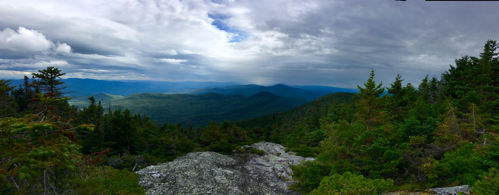
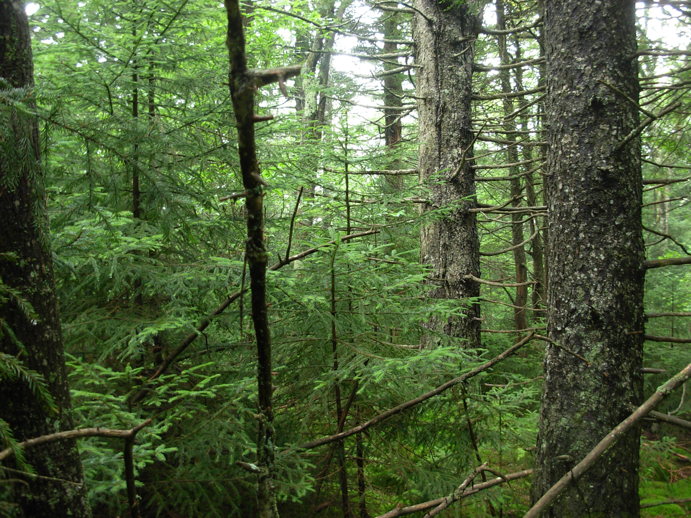
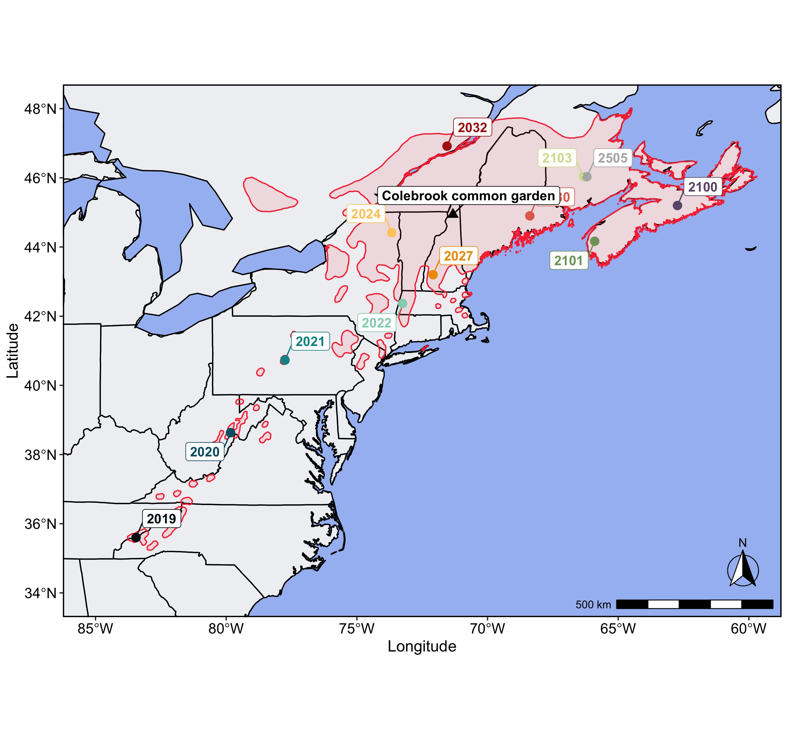

## 1. Red spruce, *Picea rubens*



Red spruce is a coniferous tree that plays a prominent role in montane communities throughout the Appalachians. It thrives in the cool, moist climates of the high elevation mountains of the Appalachians and northward along the coastal areas of Atlantic Canada. In the low-latitude trailing edge of the range, populations are highly fragmented and isolated on mountaintops. These "island" populations are remnants of spruce forests that covered the southern U.S. glaciers extended as far south as Long Island, NY. As the climate warmed at the end of the Pleistocene (\~20K years ago), red spruce retreated upward in elevation to these mountaintop refugia, where they are now highly isolated from other such stands and from the core of the range further north.


Because of its preference for cool, moist climates, red spruce shows climate sensitivities that may make it especially vulnerable to climate change. This makes assessing the amount and distribution of genetic diversity across the landscape of red spruce an important conservation issue! Ultimately, we want to use genomic insights to help inform conservation biologists working to restore red spruce and evaluate the potential for assisted migration (a form of human-mediated dispersal) to offset the loss of adaptation under climate change. 



A close partner in this effort is the [Nature Conservancy](https://www.nature.org/en-us/about-us/where-we-work/united-states/west-virginia/stories-in-west-virginia/sprucing-things-up-a-bit/) and the Central Appalachian Spruce Restoration Initiative ([CASRI](http://restoreredspruce.org)) -- a multi-partner group dedicated to restoring and enhancing red spruce populations to promote their resilience under climate change.


Some videos of the collaboration between UVM and CASRI on red spruce restoration:

-   [Building Resilience](https://youtu.be/Ld1EvG9cZN8?si=f7kRufegkeJNWsLJ)

-   [Seeds of Hope](https://youtu.be/FYKbjXB4cHs)

Since 2015, the Keller Lab has been studying the genetic basis of climate adaptation across the entire distribution of *P. rubens*. Our main goal is to use genomics to aid conservation of red spruce under climate change through a better understanding of **(1) how genetic diversity diversity is distributed across the range and how that reflects the demographic history of population expansions, bottlenecks, gene flow, and divergence** and **(2) identify regions of the genome that show evidence of adaptation in response to abiotic climate gradients.** We hope to use this information to inform areas of the range most likely to experience climate mal-adaptation, and to help guide mitigation strategies such as sourcing seed for restoration and assisted migration.

---

## 2. Summary of prior population genomics research on red spruce

Our recent work funded by NSF focused on early-life fitness of seedlings in response to population genomic variation and climate adaptation. That work sampled seeds and needle tissue from 340 mother trees at 65 populations spread throughout the range and generated population genomic data through exome capture sequencing. Seedlings from each mother were grown in multiple common gardens and measured for fitness traits. Based on these data, some of the insights we gleaned were:

-   Red spruce has very low genetic diversity and has an Ne that has been declining for thousands of years [Capblancq et al. 2020](https://onlinelibrary.wiley.com/doi/full/10.1111/eva.12985)

-   Populations are differentiated into 3 geographically separated clusters of genetic ancestry in the north (core) mid-latitude (margin) and southern (edge) regions of its range [Capblancq et al. 2020](https://onlinelibrary.wiley.com/doi/full/10.1111/eva.12985))

-   Local populations level of genetic diversity and frequency of deleterious mutations (aka, "genetic load") were related to how well seedlings survived and grew under greenhouse conditions [Capblancq et al. 2021](https://link.springer.com/article/10.1007/s10592-021-01378-7)

-   Seedling growth traits in common garden experiments showed heritable genetic variation and genetically-based trait divergence among the 3 ancestry groups [Prakash et al. 2022](https://royalsocietypublishing.org/doi/full/10.1098/rstb.2021.0008)

-   Certain genomic regions showed strong allele frequency clines along climatic gradients indicative of selection, with gene functions often related to abiotic stress (heat and drought) [Capblancq et al. 2023](https://nph.onlinelibrary.wiley.com/doi/full/10.1111/nph.18465)

-   There was a hint in some of the results that hybridization with black spruce might be playing a role in some of the above results, but we lacked genomic data from black spruce to nail that down.

-   Other studies have also found evidence for hybridization between red and black spruce (e.g., [de Lafontaine et al. 2015](https://onlinelibrary.wiley.com/doi/abs/10.1111/mec.13377?casa_token=gfaz_TTRZ3QAAAAA:SZlQ05JPnFoyfVitED9Ec87D2wTJEOLlsFqu0FjB__pNFnUAmBkBYtOBbwyZTjZAuj0UOYraM9TG3sNG), [de Lafontaine and Bousquet 2017](https://onlinelibrary.wiley.com/doi/full/10.1002/ece3.2682), [Bashalkhanov et al. 2023](https://www.frontiersin.org/journals/plant-science/articles/10.3389/fpls.2023.1272362/full)), but the evolutionary outcomes for what this means for adaptation to local environments are still not well understood.

**Let's brainstorm about some issues these data couldn't address, or where the inference of evolutionary history or adaptation were constrained by aspects of the experimental design or sampling?**

*What questions would we want to ask next?*

---

## 3. A new dataset for analysis

The data we'll be analyzing here consist of exome capture data for adult red spruce growing in a [provenance trial in northern New Hampshire near the town of Colebrook](https://goo.gl/maps/4LSPvpN2RdVbUuH78). Here are the details:

-   95 individuals sampled from 12 populations across the range (N=190 red spruce)

-   Individuals were grown from seed and planted out into the provenance trial as 2 year old seedlings in 1960

-   Multiple studies have assessed survival, growth (height DBH), and cold tolerance of these individuals at multiple time points over the last 60 years

-   Needle tissue was sampled from surviving red spruce in the trial in May 2020 for genomic DNA

-   We also sampled 18 black spruce individuals from natural stands in 2 locations distant from red spruce's range (MN and MI).
    -   These will be useful for detecting black spruce ancestry in the sampled red spruce populations, if it exists!

-   We used the same exome-capture probe set as Capblancq et al. (2020).  *Why exome capture instead of alternatives (WGS, or RAD/GBS)??*

-   Exome-capture was designed based on transcriptomes from multiple tissues and developmental stages in the related species, white spruce (*P. glauca*).

-   Bait design used 2 transcriptomes previously assembled by [Rigault et al. (2011)](https://academic.oup.com/plphys/article/157/1/14/6108725) and [Yeaman et al. (2014)](https://nph.onlinelibrary.wiley.com/doi/full/10.1111/nph.12819).

-   A total of 80,000 120 bp probes were designed, including 75,732 probes within or overlapping exomic regions, and an additional 4,268 probes in intergenic regions.

-   Each probe was required to represent a single blast hit to the *P. glauca* reference genome of at least 90bp long and 85% identity, covering **38,570 unigenes**.

-   Libraries were made by random mechanical shearing of DNA (250 ng -1ug) to an average size of 400 bp followed by ligation of barcoded adapters, and PCR-amplification of the library. SureSelect probes (Agilent Technologies: Santa Clara, CA) were used for targeted enrichment following the SureSelect Target Enrichment System for Illumina Paired-End Multiplexed Sequencing Library protocol.

-   Libraries were sequenced on an Illumina HiSeq to generate paired-end 150-bp reads.

Here's the table of sample population codes used in file naming and their source localities

```{r, echo=FALSE}
library(data.table)
dat = read.csv("~/Documents/GitHub/Ecological-Genomics/Fall2023/data/RS_sampleSites.csv", header=F)
names(dat) = c("PopCode","PopName","State/Province","Country","Latitude","Longitude","Elevation")
knitr::kable(dat)
```

And here's a map of the sample sites within the red spruce range:




