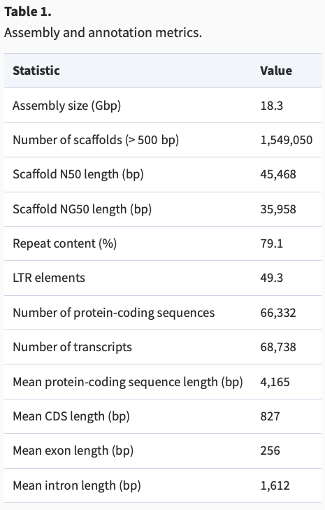

Our previous analysis finished (hopefully!) with cleaned fastq files that are free of low quality bases and adapter sequences. We're now ready to map these reads to the spruce reference genome!

## 1. Obtaining and indexing the reference genome

The first step of read mapping is downloading and preparing the reference genome.

The black spruce (*Picea mariana*) reference genome was [published by Lo et al. (2024)](https://academic.oup.com/g3journal/article/14/1/jkad247/7329279).



You don't actually need to download the genome because we already have the file in the directory below. But for future reference `wget` is a useful command to ownload files from the web.

```         
cd /gpfs1/cl/ecogen/pbio6800/PopulationGenomics/ref_genome

wget "ftp://plantgenie.org:980/Data/PlantGenIE/Picea_abies/v1.0/fasta/GenomeAssemblies/Pabies01-genome.fa.gz"
```

Rather than trying to map to the entire 18+ Gbp reference (yikes!), we first subsetted the *P. mariana* reference to include **just the contigs that contain one or more of our 80,000 probes** from our exome capture experiment. For this, we did a BLAST search of each probe against the *P. mariana* reference genome, and then retained all scaffolds that had a best hit.

-   This reduced reference contains:
    -   2,927,599,912 bp (\~2.93 Gbp) in 28,953 scaffolds
    -   The largest scaffold is 3,698,311 (\~3.7 Mbp)
    -   The N50 of the reduced reference is 250,906 bp
-   The indexed reduced reference genome to use for your mapping is on our server here:

`/gpfs1/cl/ecogen/pbio6800/PopulationGenomics/ref_genome/Pmariana/Pmariana-genome_reduced.fa`

## 2. Mapping our cleaned and trimmed reads against the reference genome!

Let's cd to the class directory where shared files live:

`cd /gpfs1/cl/ecogen/pbio6800/PopulationGenomics/`

Become familiar with this part of the filesystem -- it's where a lot of our shared data and scripts will reside.  

Take a peek inside each directory:

`cleanreads/`

`bams/` 

`scripts/`

### To help make our scripting approach efficient, we're going to use several short scripts, running each one at a time. In the future, we could put them all together into a single pipeline

From the `scripts/` directory, copy the following files over to your repo and save them into your `myscripts/` directory:

```
mapping.sh  
process_bam.sh  
bam_stats.sh 
SBATCH_header.txt
```


-   For mapping, we'll use the program [bwa-mem2](https://github.com/bwa-mem2/bwa-mem2), which is a very efficient and very well vetted read mapper. Lots of others exist and can be useful to explore for future datasets. We tried several, and for our exome data, bwa seems to be the best. the citation info for bwa-mem2 is here: [Vasimuddin et al. 2019](https://ieeexplore.ieee.org/document/8820962)


-   Let's customize the bash script called `mapping.sh` that calls the R1 and R2 reads for each individual in your population, and uses the `bwa-mem2` algorithm to map reads to the reduced black spruce reference genome. 

The basic `bwa-mem2` command we'll use is below:

```         
bwa-mem2 mem -t 10 ${REF} ${READ1} ${READ2} > ${OUT}${NAME}.sam
```

where

```         
-t 10 is the number of threads, or computer cpus to use (in this case, 10)
-${REF} specifies the path and filename for the reference genome
${READ1} specifies the path and filename for the cleaned and trimmed R1 reads 
${READ2} specifies the path and filename for the cleaned and trimmed R2 reads 
>${OUT}/${NAME}.sam  specifies the path and filenam for the .sam file to be saved into a new directory
```

Think about how we should write this into a loop to call all the fastq files for our population of interest...(hint, look back at the `fastp.sh` script)

Open up the `mapping.sh` script and let's customize the fields together.

Because you're each mapping sequences from multiple samples (N=8/pop), it's going to take a little while.

Whenever you have a job that will take a long time, you're going to want to run it on the cluster by writing a batch script and submitting to the SLURM scheduler (remember Shelly and Bennet's VACC tutorial?)

You'll find a version of the SBATCH header in this file you copied to your `myscripts/` directory: 

`SBATCH_header.txt`

Open that in RStudio text editor and copy/paste it into your mapping.sh script.  Be sure to paste the header *below* the top line `#!/bin/bash`

Custom the SBATCH settings to your run and resource needs!

When we're ready, cd to your `scripts/` folder and submit to SLURM like so:

```
cd ~/projects/eco_genomics_2025/population_genomics/myscripts

sbatch mapping.sh
```

We can check on the status of our submission"

`squeue --me`

And if you ever need to stop the run:

`scancel jobID` where jobID is the unique ID number assigned to your job


## 3. Process the alignment files

The second step will be to process the sequence alignment files (SAM files) that are outputs of the `mapping.sh` script.

-   We can use the program [sambamba](https://lomereiter.github.io/sambamba/) for manipulating sam/bam files. This program was published by [Tarasov et al. 2015](https://academic.oup.com/bioinformatics/article/31/12/2032/214758?login=true). 

- There are several steps we need to do: 

  -  convert sam alignment file to (binary) bam format
  -  sort the bam file by its read coordinates
  -  mark and remove PCR duplicate reads
  -  index the processed alignment file for quick lookup

- Open up the `process_bams.sh` script and we'll customize the fields together

- Add the SBATCH header and submit to SLURM!


## 4. Calculate mapping stats: How can we get a summary of how well our reads mapped to the reference? 

- We can use the program [samtools](https://github.com/samtools/samtools) Written by Heng Li, the same person who wrote bwa. It is a powerful tool for manipulating sam/bam files.  The citation is here: [Danecek et al. 2021](https://academic.oup.com/gigascience/article/10/2/giab008/6137722?login=true)

- The samtools command `flagstat` gets us some basic info on how well the mapping worked

- We can also estimate depth of coverage (avg. number of reads/site) using the samtools command `depth`

- We'll use both of these commands in loops to assess the mapping stats on each sample in our population.

- We'll also use the `awk` tool to help format the output.  

- Open up the `bam_stats.sh` script and let's customize it together.

- Add the SBATCH header and submit to SLURM!


### Something for the future: You could put it all together in one pipeline

Now that we have each of our mapping, processing, and stats scripts written, if we ran this again in the future or on other data, we could put these separate scripts into a single pipeline script and submit to the cluster.

Here's how we'd do it:


1. Open a new text file in RStudio
2. On the first line, write `#!/bin/bash` to let it know this is a bash script
3. Paste the SBATCH_header.txt to the top
4. Code the lines below into the body of the script:

```

# cd to your `scripts/` folder in your repo:

cd ~/projects/eco_genomics_2025/population_genomics/myscripts

# Step 1: map reads to the reference

bash mapping.sh

# Step 2: process the alignment files

bash process_bams.sh

# Step 3. get stats on our alignments

bash bam_stats.sh

```

Save as `mypipeline.sh`

At the terminal, cd to your `scripts/` folder and submit by writing:

`sbatch mypipeline.sh`

Check the status of your job:

`squeue --me`

## 5. Visually inspect the alignment using samtools tview

We can get a sense of how the data look after they're aligned by using the alignment viewer `tview` built into `samtools`

We just need a indexed bam file and an indexed reference genome.

Here's an example using a previously processed bam file, but you can use your own once they're done being mapped:

```
module load gcc samtools 

samtools tview \
/gpfs1/cl/ecogen/pbio6800/PopulationGenomics/examples/2030_57_O.sorted.rmdup.bam \
/gpfs1/cl/ecogen/pbio6800/PopulationGenomics/ref_genome/Pmariana/Pmariana1.0-genome_reduced.fa

```


